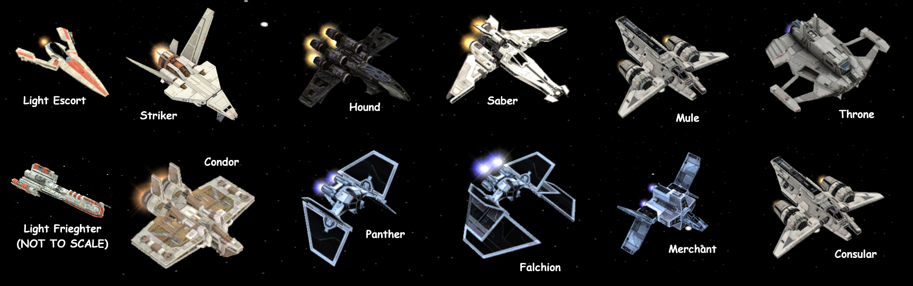

# Stars Wars Info

Stars Wars Info site is an information resource about Starships from the Star Wars films.
This includes all the details you could ever want to know, including models, size, passenger
capacity, cost, crew size, hyperdrive ratings, and more!  All this is presented in a searchable
and sortable information site, so you can impress your friends with your astute
(and perhaps excessive) trivia knowledge.

## Project Structure

At the root of the solution there are several project folders:
- __/DevTools__: Scripts/tools for developers that simplify environment management.
- __/Postgres__: Files and configurations for the Postgres database service.
- __/SSL__: PEM-formatted SSL certificate and key files for use with API, client, & Keycloak services.
- __/StarWarsClient__: The React.js front end client application (via Vite)
- __/StarWarsInfo__: The backend API project, written in .NET as a REST provider

## Developer Resources and Links
- [Star Wars API](https://swapi.info//)
- [Keycloak, Importing Realm on Startup](https://www.keycloak.org/nightly/server/containers#_importing_a_realm_on_startup)
- [Keycloak, Full Env Variables Reference](https://www.keycloak.org/server/all-config)
- [Postgres, Initialization Scripts](https://hub.docker.com/_/postgres#initialization-scripts)